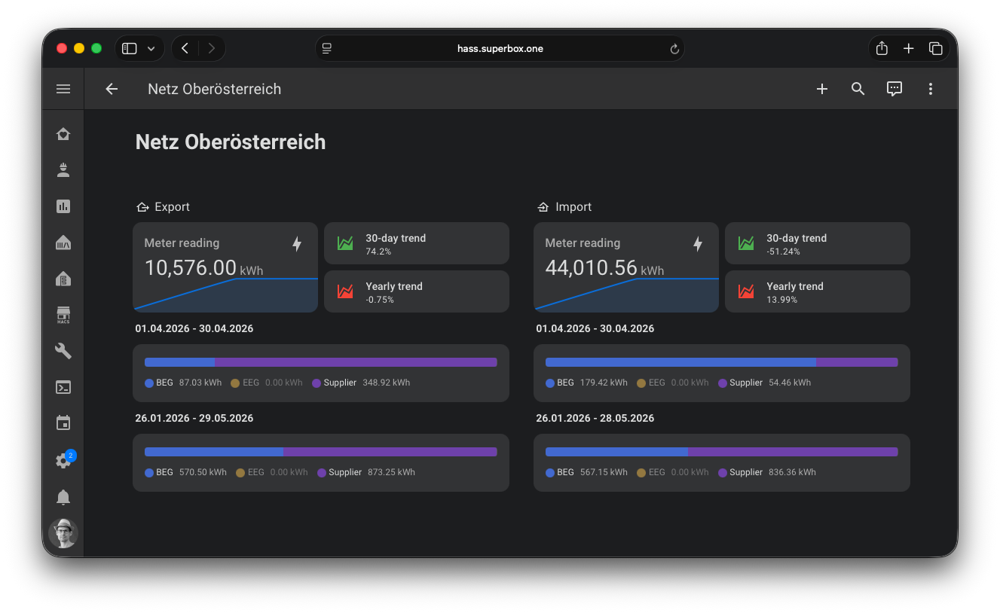

# Netz OÖ eService

A Home Assistant integration to read energy data from the Netz OÖ eService portal.

## Requirements

* A running instance of Home Assistant with [HACS](https://hacs.xyz/) installed for managing custom integrations.

## Getting started

[][redirect-hacs]

1. Install this integration with HACS (search for "Netz OÖ eService") or copy the contents of this repository into the
   `custom_components/netzooe_eservice` directory.
2. Restart Home Assistant after installation completes.
3. Start the configuration flow: go to `Configuration` -> `Integrations`, click the `+ Add Integration` and select
   `Netz OÖ eService` from the list.
4. Add username and passwort from your Netz OÖ eService portal.

[redirect-hacs]: https://my.home-assistant.io/redirect/hacs_repository/?owner=mh-superbox&repository=netzooe_eservice&category=integration

## Donation

I put a lot of time into this project. If you like it, you can support me with a donation.

[][kofi]

[kofi]: https://ko-fi.com/F2F0KXO6D

## Changelog

The changelog lives in the [CHANGELOG.md](CHANGELOG.md) document.
The format is based on [Keep a Changelog](https://keepachangelog.com/en/1.0.0/).

## Get Involved

The **Netz OÖ eService Integration** is an open-source project and contributions are welcome. You can:

* Report [issues](https://github.com/superbox-dev/netzooe_eservice/issues/new/choose) or request new features
* Improve documentation or translations
* Contribute code
* Support the project by starring it on GitHub ⭐

I'm happy about your contributions to the project!
You can get started by reading the [CONTRIBUTING.md](CONTRIBUTING.md).

[][workflow-ci]
![Typing: strict][typing-strict]
![Code style: black][code-black]
![Code style: Ruff][code-ruff]

[workflow-ci]: https://github.com/superbox-dev/netzooe_eservice/actions/workflows/ci.yml
[typing-strict]: https://img.shields.io/badge/typing-strict-green.svg
[code-black]: https://img.shields.io/badge/code%20style-black-black
[code-ruff]: https://img.shields.io/endpoint?url=https://raw.githubusercontent.com/charliermarsh/ruff/main/assets/badge/v1.json
